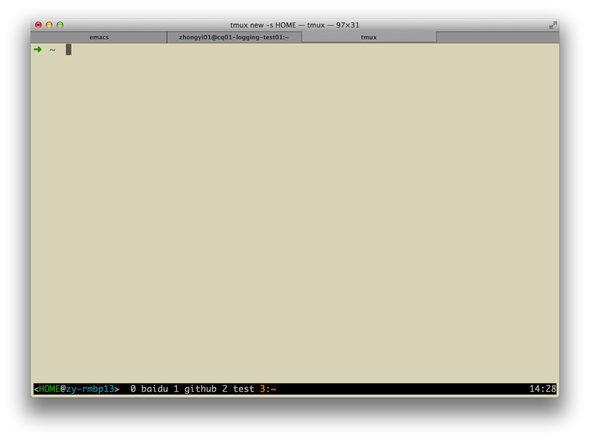

tmux.conf
=========

zy's .tmux.conf

# Usage（用法）
1. backup your own ~/.tmux.conf （备份你自己的tmux配置）
2. git clone this project （克隆本项目）
3. create a symbolic link from ~/.tmux.conf to the .tmux.conf under this project （建立软连接）

# Screenshot（截图）

